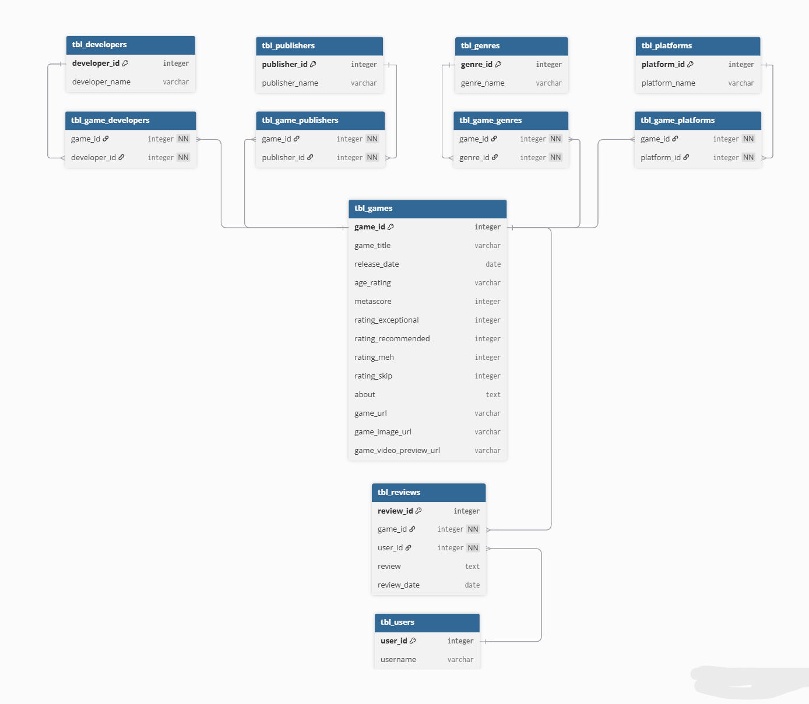

<p align="center">
  
</p>

<h1 align="center">Game Platform Dashboard</h1>

<p align="center">
<h3 align="center">Explore Insights and Trends from Game Data</h3>
</p>

---

<h2 align="center">📌 Menu</h2>

<br>

<table align="center" cellpadding="12">
<tr>
<td align="center">
<a href="#1-dashboard-description">
  
</a>
</td>

<td align="center">
<a href="#2-dashboard-section">
  
</a>
</td>
</tr>

<tr>
<td align="center">
<a href="#3-database-schema--data-structure">
  
</a>
</td>

<td align="center">
<a href="#4-tools-used">
  
</a>
</td>
</tr>

<tr>
<td align="center">
<a href="#5-project-folder-structure">
  
</a>
</td>

<td align="center">
<a href="#6-team-contribution">
  
</a>
</td>
</tr>

<tr>
<td align="center">
<a href="#7-team-members">
  
</a>
</td>
</tr>
</table>
---

# 1. Dashboard Description 

Game Platform Dashboard adalah aplikasi interaktif berbasis **R Shiny** yang dirancang untuk menganalisis dan memvisualisasikan data game dari berbagai aspek.

**Tujuan Proyek:**

- Memberikan insight performa dan popularitas game berdasarkan rating dan review
- Menyediakan rekomendasi game sesuai usia (Age Rating) dan genre
- Memvisualisasikan tren rilis game dan distribusi score
- Membantu analisis keputusan bisnis bagi pengembang dan pemain game

**Fitur utama:**

- 📊 Visualisasi interaktif menggunakan **Plotly**  
- 📋 Tabel dinamis menggunakan **DT**  
- 🔄 Reactive programming pada Shiny  
- 🗄️ Integrasi database menggunakan **DBI + RMariaDB**

---

# 2. Dashboard Section

## Home
Menampilkan:

- Total Game & Total Review  
- Banner Top Game (Video Preview / Image)  
- Rekomendasi Game berdasarkan Age Rating dan Genre  

## Search
Fitur pencarian dan filter interaktif:

- Genre, Platform, Age Rating, Minimum Score
- Tabel interaktif & klik row untuk membuka halaman game
- Download CSV hasil filter

## Overview
Menampilkan analisis statistik dan visualisasi:

- Genre paling populer berdasarkan review
- Distribusi score game
- Top 10 game berdasarkan score
- Top 10 game berdasarkan jumlah review
- Game dengan metascore tertinggi
- Genre dengan rata-rata score tertinggi
- Tren rilis game per tahun
- Insight Cards: Peak release, score distribution, review concentration, user vs critic score

## About Team
Menampilkan profil anggota tim dan peran masing-masing.

---

# 3. Database Schema & Data Structure

Database relasional dengan tabel utama:

- `tbl_games`  
- `tbl_reviews`  
- `tbl_users`  
- `tbl_genres`  
- `tbl_platforms`  
- `tbl_game_genres`  
- `tbl_game_platforms`  

### ERD


*ERD menunjukkan relasi antar tabel utama dan foreign key.*

### Skema Tabel



*Skema tabel menampilkan detail kolom, tipe data, dan constraints.*

---

# 4. Tools Used

| Tool | Fungsi | Gambar |
|------|-------|--------|
| **R Studio** | IDE & Language – Lingkungan utama pengembangan skrip R dan manajemen proyek |  |
| **R Shiny** | Web Framework – Membangun dashboard interaktif dan reaktivitas visualisasi |  |
| **DBngin** | DB Engine – Menjalankan mesin database lokal untuk penyimpanan data relasional |  |
| **TablePlus** | DB Management – Mengelola skema tabel, relasi, dan memvalidasi query SQL secara visual |  |

---

# 5. Project Folder Structure

```bash
project-dashboard/
│
├── data/
│   ├── raw/
│   └── processed/
│
├── app/
│   ├── app.R
│   ├── ui.R
│   └── server.R
│
├── connection/
│   └── db_connection.R
│
├── doc/
│   └── erd.pdf
│
├── Images/
│
└── README.md
