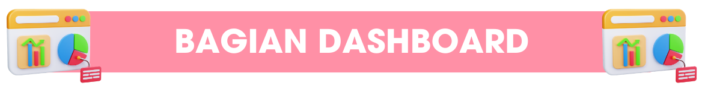
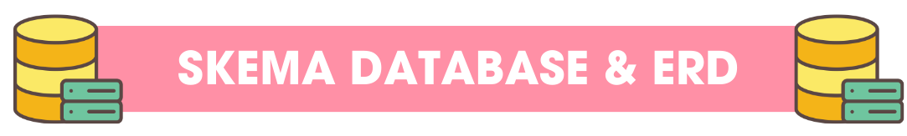
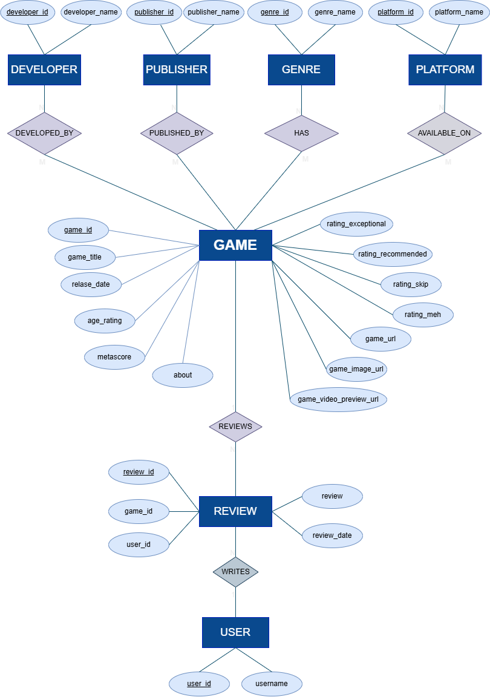
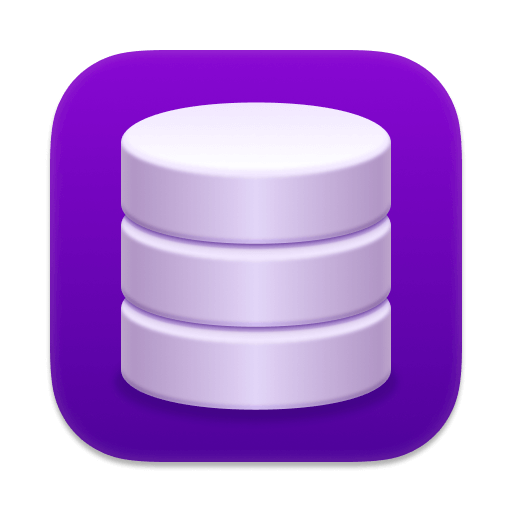

<p align="center">
  
</p>

<p align="center">
<h3 align="center"> Explore Insights and Trends from Game Data </h3>
</p>

---

<p align="center">
  
</p>


<table align="center" border="0">
<tr>
  <td align="center">
    <a href="#deskripsi-dashboard">
      
    </a>
  </td>
  <td align="center">
    <a href="#bagian-dashboard">
      
    </a>
  </td>
  <td align="center">
    <a href="#skema-database-erd">
      
    </a>
  </td>
</tr>
<tr>
  <td align="center">
    <a href="#tools">
      
    </a>
  </td>
  <td align="center">
    <a href="#struktur-folder">
      
    </a>
  </td>
  <td align="center">
    <a href="#kontribusi-tim">
      
    </a>
  </td>
  </tr>
<tr> 
  <td align="center" colspan="3"> 
    <a href="#kolaborator"> 
       
    </a> 
  </td> 
</tr>
</table>


---

<!-- Deskripsi Dashboard -->
<a id="deskripsi-dashboard"></a>
<p align="center">
  
</p> 

Game Platform Dashboard adalah aplikasi interaktif berbasis **R Shiny** yang dirancang untuk menganalisis dan memvisualisasikan data game dari berbagai aspek.

**Tujuan Proyek:**

- Memberikan insight performa dan popularitas game berdasarkan rating dan review
- Menyediakan rekomendasi game sesuai usia (Age Rating) dan genre
- Memvisualisasikan tren rilis game dan distribusi score
- Membantu analisis keputusan bisnis bagi pengembang dan pemain game

**Fitur utama:**

- 📊 Visualisasi interaktif menggunakan **Plotly**  
- 📋 Tabel dinamis menggunakan **DT**  
- 🔄 Reactive programming pada Shiny  
- 🗄️ Integrasi database menggunakan **DBI + RMariaDB**

---

<!-- Bagian Dashboard -->
<a id="bagian-dashboard"></a>
<p align="center">
  
</p>


## Home
Menampilkan:

- Total Game & Total Review  
- Banner Top Game (Video Preview / Image)  
- Rekomendasi Game berdasarkan Age Rating dan Genre  

## Search
Fitur pencarian dan filter interaktif:

- Genre, Platform, Age Rating, Minimum Score
- Tabel interaktif & klik row untuk membuka halaman game
- Download CSV hasil filter

## Overview
Menampilkan analisis statistik dan visualisasi utama dari data game untuk memahami tren, performa, dan popularitas. Berikut detail setiap visualisasi:

### 1. Game Releases Over Time
Menunjukkan tren jumlah rilis game per tahun sehingga dapat mengidentifikasi periode dengan aktivitas rilis tertinggi.
<p align="center">
  
</p>

### 2. Game Score Distribution
Distribusi skor game membantu melihat persebaran kualitas game berdasarkan rating pengguna.
<p align="center">
  
</p>

### 3. Games Highest Metascore
Menampilkan game dengan nilai kritikus tertinggi, berguna untuk analisis kualitas review profesional.
<p align="center">
  
</p>

### 4. Games Highest Score
Menunjukkan game dengan skor pengguna tertinggi, membantu menilai kepuasan pemain.
<p align="center">
  
</p>

### 5. Genre Highest Average Score
Mengidentifikasi genre dengan rata-rata skor tertinggi, berguna untuk rekomendasi genre populer.
<p align="center">
  
</p>

### 6. Genre Popularity Based on Reviews
Visualisasi genre paling populer berdasarkan jumlah review, menilai engagement komunitas.
<p align="center">
  
</p>

### 7. Most Popular Age Rating
Menampilkan age rating dengan jumlah game terbanyak untuk mengetahui target audiens dominan.
<p align="center">
  
</p>

### 8. Most Popular Genre
Menunjukkan genre dengan total review terbanyak, berguna untuk analisis popularitas.
<p align="center">
  
</p>

### 9. Most Popular Platform
Menampilkan platform game paling populer berdasarkan jumlah occurrences/total review.
<p align="center">
  
</p>

### 10. Review Overview
Memberikan overview jumlah review per game, membandingkan review user vs critic.
<p align="center">
  
</p>

### 11. Top Game 2016
Menunjukkan game terbaik tahun 2016 berdasarkan skor dan jumlah review.
<p align="center">
  
</p>

### 12. Top Games by Score
Menampilkan daftar 10 game terbaik berdasarkan skor, termasuk perbandingan skor pengguna dan kritikus.
<p align="center">
  
</p>

### 13. Key Insights
Menyediakan ringkasan insight utama dari data game seperti peak release, score distribution, dan review concentration.
<p align="center">
  
</p>

## About Team
Menampilkan profil anggota tim dan peran masing-masing.

---

<!-- Skema Database & ERD -->
<a id="skema-database-erd"></a>
<p align="center">
  
</p>


### Skema Tabel

<p align="center">
  
</p> 

Database relasional dengan tabel utama:

- `tbl_games`: Menyimpan informasi dasar tentang setiap game, termasuk id, judul, tanggal rilis, rating pengguna (exceptional, recommended, meh, skip), age rating, metascore, about, link url, dan link gambar dan video preview.  
- `tbl_reviews`: Mencatat review yang diberikan oleh pengguna, termasuk ID review, ID game terkait, ID pengguna, isi review dan tanggal review.  
- `tbl_users`: Berisi informasi tentang pengguna yang membuat review, termasuk username, dan ID pengguna.  
- `tbl_genres`: Menyimpan daftar ID genre dan jenis genre game yang ada di database, misal Action, RPG, Adventure, dan lain-lain. 
- `tbl_platforms`: Mencatat ID platform dan jenis platform tempat game dirilis/dimainkan, misal PC, PlayStation, Xbox, Nintendo Switch, dan sebagainya.  
- `tbl_developers`: Menampung informasi ID pengembang game (developer) dan termasuk nama dan detail perusahaan/pengelola studio.  
- `tbl_publisher`: Berisi informasi ID penerbit (publisher) game dan termasuk nama dan detail perusahaan yang merilis game ke pasar.
 

### ERD

<p align="center">
  
</p>

*ERD menunjukkan relasi antar tabel utama dan foreign key.*

Dashboard ini menggunakan struktur database relasional dengan tabel utama dan relasinya. Berikut penjelasan primary key dan foreign key tiap tabel:

#### Primary Key (PK)
- `game_id` (tabel GAME)
- `review_id` (tabel REVIEW)
- `user_id` (tabel USER)
- `developer_id` (tabel DEVELOPER)
- `publisher_id` (tabel PUBLISHER)
- `genre_id` (tabel GENRE)
- `platform_id` (tabel PLATFORM)

#### Foreign Key (FK)
- `developer_id` pada tabel GAME → menghubungkan ke tabel DEVELOPER
- `publisher_id` pada tabel GAME → menghubungkan ke tabel PUBLISHER
- `genre_id` pada tabel GAME → menghubungkan ke tabel GENRE
- `platform_id` pada tabel GAME → menghubungkan ke tabel PLATFORM
- `game_id` pada tabel REVIEW → menghubungkan ke tabel GAME
- `user_id` pada tabel REVIEW → menghubungkan ke tabel USER

#### Relasi Tabel
- Tabel DEVELOPED_BY menghubungkan `developer_id` dan `game_id`
- Tabel PUBLISHED_BY menghubungkan `publisher_id` dan `game_id`
- Tabel HAS menghubungkan `genre_id` dan `game_id`
- Tabel AVAILABLE_ON menghubungkan `platform_id` dan `game_id`
- Tabel WRITES menghubungkan `review_id`, `game_id`, dan `user_id`

**Catatan:**  
- Primary key memastikan setiap record unik di tabelnya.  
- Foreign key menghubungkan tabel transaksi atau referensi ke tabel master, menjaga integritas data.  
- Relasi N:M ditangani melalui tabel relasi seperti DEVELOPED_BY, PUBLISHED_BY, HAS, dan AVAILABLE_ON.

---

<!-- Tools -->
<a id="tools"></a>
<p align="center">
  
</p>


| Tool | Fungsi | Gambar |
|------|-------|--------|
| **R Studio** | IDE & Language – Lingkungan utama pengembangan skrip R dan manajemen proyek | <div align="center"></div> |
| **R Shiny** | Web Framework – Membangun dashboard interaktif dan reaktivitas visualisasi | <div align="center"></div> |
| **DBngin** | DB Engine – Menjalankan mesin database lokal untuk penyimpanan data relasional | <div align="center"></div> |
| **TablePlus** | DB Management – Mengelola skema tabel, relasi, dan memvalidasi query SQL secara visual | <div align="center"></div> |

---

<!-- Struktur Folder -->
<a id="struktur-folder"></a>
<p align="center">
  
</p>


```bash
STA2562-Game-Dataset/
│
├── App/ # Folder utama aplikasi R Shiny
│ ├── App.R # File utama yang menjalankan aplikasi
│ ├── Ui.R # Komponen UI (tampilan) dashboard
│ ├── Server.R # Komponen server (backend) dashboard
│ └── README.md # Penjelasan singkat terkait folder App
│
├── Connection/ # Folder untuk skrip koneksi database
│ └── connection_database.R # Script untuk menghubungkan R ke database
│
├── Data/ # Folder untuk data proyek
│ ├── Raw/ # Data mentah dari sumber eksternal
│ │ └── Dataset Game Raw.csv
│ │
│ └── Processed/ # Data hasil preprocessing
│ ├── tbl_developers.csv
│ ├── tbl_game_developers.csv
│ ├── tbl_game_genres.csv
│ ├── tbl_game_platforms.csv
│ ├── tbl_game_publishers.csv
│ ├── tbl_games.csv
│ ├── tbl_genres.csv
│ ├── tbl_platforms.csv
│ ├── tbl_publishers.csv
│ ├── tbl_reviews.csv
│ └── tbl_users.csv
│
├── Doc/ # Folder dokumentasi
│ └── Basis Data dan ERD.pdf
│
├── Images/ # Folder untuk semua gambar visualisasi dan ilustrasi
│ ├── Bagian.png
│ ├── Dbngin.png
│ ├── Deskripsi.png
│ ├── ERD.png
│ ├── Folder.png
│ ├── Game Releases Over Time.jpeg
│ ├── Game Score Distribution.jpeg
│ ├── Games Highest Metascore.png
│ ├── Games Highest Score.png
│ ├── Genre Highest Average Score.png
│ ├── Genre Popularity Based on Reviews.jpeg
│ ├── Header Github.jpeg
│ ├── Key Insights.png
│ ├── Menu.png
│ ├── Most Popular Age Rating.png
│ ├── Most Popular Genre.png
│ ├── Most Popular Platform.png
│ ├── R Shiny.png
│ ├── Review Overview.jpeg
│ ├── Rstudio.png
│ ├── Skema Tabel.png
│ ├── Skema.png
│ ├── Tableplus.png
│ ├── Tim.png
│ ├── Tools.png
│ ├── Top Game 2016.png
│ ├── Top Games by Score.jpeg
│ ├── team1.png
│ ├── team2.png
│ ├── team3.png
│ └── team4.png
│
├── Script/ # Folder berisi script R tambahan dan query
│ ├── Query.txt # SQL query referensi
│ ├── X1_load_raw_to_db.R # Script memuat data raw ke database
│ ├── X2_etl_processing.R # Script transformasi dan pembersihan data
│ └── X3_load_processed_to_db.R # Script memuat data processed ke database
│
└── README.md # File utama dokumentasi project
```

---


<!-- Kontribusi Tim -->
<a id="Kolabolator"></a>
<p align="center">
  
</p>


## 👩‍💻 Database Manager
**Fokus:** Database & Query

### Tanggung Jawab
- Mendesain struktur database (tabel, relasi, primary–foreign key)
- Menyusun ERD
- Menyiapkan database
- Menulis dan menguji query SQL:
  - JOIN antar tabel
  - WHERE, GROUP BY
  - Agregasi (COUNT, SUM, AVG)
- Optimasi dasar query (index/view bila diperlukan)
- Menyediakan query SQL siap pakai untuk backend RShiny

### Batasan
- Tidak mengerjakan UI
- Tidak menulis server logic Shiny

### Output Wajib
- ERD
- Skema tabel
- Query SQL tervalidasi

---

## ⚙️ Backend Developer
**Fokus:** Logika Aplikasi RShiny (Server)

### Tanggung Jawab
- Menghubungkan R dengan database menggunakan DBI dan driver terkait
- Menjalankan query SQL dari database
- Membuat fungsi backend untuk pengambilan dan pengolahan data
- Mengelola reaktivitas Shiny:
  - `reactive()`
  - `observeEvent()`
- Menyediakan output ke frontend:
  - `renderPlot()`
  - `renderTable()`
- Menangani error dan validasi input

### Batasan
- Tidak mengatur layout UI
- Tidak menentukan desain visual

### Output Wajib
- File `server.R` sebagai input dalam `app.R`
- Backend berjalan stabil dan efisien

---

## 🎨 Frontend Developer
**Fokus:** Tampilan & Interaksi Pengguna

### Tanggung Jawab
- Mendesain struktur UI dashboard (Sidebar, navbar, tabPanel)
- Membuat komponen input:
  - `selectInput()`
  - `dateRangeInput()`
- Menyusun placeholder output:
  - `plotOutput()`
  - `tableOutput()`
- Mengatur tata letak dan alur interaksi pengguna
- Mengintegrasikan output server ke UI
- Menjaga konsistensi layout dan keterbacaan visual

### Batasan
- Tidak mengakses database
- Tidak menulis logika data di server

### Output Wajib
- File `ui.R` sebagai input dalam `app.R`
- Dashboard tampil rapi dan mudah digunakan

---

## 📊 Data Analyst
**Fokus:** Insight, Validasi, dan Evaluasi

### Tanggung Jawab
- Menentukan KPI dan kebutuhan analitik dashboard
- Memvalidasi hasil dashboard dengan data database
- Melakukan pengujian dashboard (filter ekstrem, data kosong)
- Menyusun interpretasi hasil dan insight utama
- Menyusun dokumentasi dan laporan akhir

### Batasan
- Tidak bertanggung jawab atas UI dan server utama

### Output Wajib
- Daftar KPI dan insight
- Dokumentasi project
