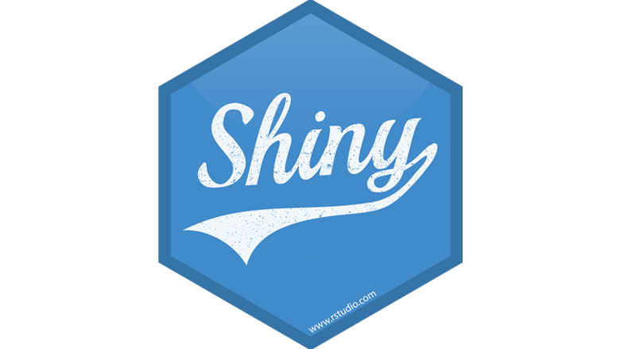

<p align="center">
  
</p>

<h1 align="center">Game Platform Dashboard</h1>

<p align="center">
<h3 align="center">Explore Insights and Trends from Game Data</h3>
</p>

---

<h2 align="center">📌 Menu</h2>

<br>

<table align="center" cellpadding="12">
<tr>
<td align="center">
<a href="#1-dashboard-description">
  
</a>
</td>

<td align="center">
<a href="#2-dashboard-section">
  
</a>
</td>
</tr>

<tr>
<td align="center">
<a href="#3-database-schema--data-structure">
  
</a>
</td>

<td align="center">
<a href="#4-tools-used">
  
</a>
</td>
</tr>

<tr>
<td align="center">
<a href="#5-project-folder-structure">
  
</a>
</td>

<td align="center">
<a href="#6-team-contribution">
  
</a>
</td>
</tr>

<tr>
<td align="center">
<a href="#7-team-members">
  
</a>
</td>
</tr>
</table>
---

# 1. Dashboard Description 

Game Platform Dashboard adalah aplikasi interaktif berbasis **R Shiny** yang dirancang untuk menganalisis dan memvisualisasikan data game dari berbagai aspek.

**Tujuan Proyek:**

- Memberikan insight performa dan popularitas game berdasarkan rating dan review
- Menyediakan rekomendasi game sesuai usia (Age Rating) dan genre
- Memvisualisasikan tren rilis game dan distribusi score
- Membantu analisis keputusan bisnis bagi pengembang dan pemain game

**Fitur utama:**

- 📊 Visualisasi interaktif menggunakan **Plotly**  
- 📋 Tabel dinamis menggunakan **DT**  
- 🔄 Reactive programming pada Shiny  
- 🗄️ Integrasi database menggunakan **DBI + RMariaDB**

---

# 2. Dashboard Section

## Home
Menampilkan:

- Total Game & Total Review  
- Banner Top Game (Video Preview / Image)  
- Rekomendasi Game berdasarkan Age Rating dan Genre  

## Search
Fitur pencarian dan filter interaktif:

- Genre, Platform, Age Rating, Minimum Score
- Tabel interaktif & klik row untuk membuka halaman game
- Download CSV hasil filter

## Overview
Menampilkan analisis statistik dan visualisasi utama dari data game untuk memahami tren, performa, dan popularitas. Berikut detail setiap visualisasi:

---

### 1. Game Releases Over Time
Menunjukkan tren jumlah rilis game per tahun sehingga dapat mengidentifikasi periode dengan aktivitas rilis tertinggi.
<p align="center">
  
</p>

---

### 2. Game Score Distribution
Distribusi skor game membantu melihat persebaran kualitas game berdasarkan rating pengguna.
<p align="center">
  
</p>

---

### 3. Games Highest Metascore
Menampilkan game dengan nilai kritikus tertinggi, berguna untuk analisis kualitas review profesional.
<p align="center">
  
</p>

---

### 4. Games Highest Score
Menunjukkan game dengan skor pengguna tertinggi, membantu menilai kepuasan pemain.
<p align="center">
  
</p>

---

### 5. Genre Highest Average Score
Mengidentifikasi genre dengan rata-rata skor tertinggi, berguna untuk rekomendasi genre populer.
<p align="center">
  
</p>

---

### 6. Genre Popularity Based on Reviews
Visualisasi genre paling populer berdasarkan jumlah review, menilai engagement komunitas.
<p align="center">
  
</p>

---

### 7. Most Popular Age Rating
Menampilkan age rating dengan jumlah game terbanyak untuk mengetahui target audiens dominan.
<p align="center">
  
</p>

---

### 8. Most Popular Genre
Menunjukkan genre dengan total review terbanyak, berguna untuk analisis popularitas.
<p align="center">
  
</p>

---

### 9. Most Popular Platform
Menampilkan platform game paling populer berdasarkan jumlah occurrences/total review.
<p align="center">
  
</p>

---

### 10. Review Overview
Memberikan overview jumlah review per game, membandingkan review user vs critic.
<p align="center">
  
</p>

---

### 11. Top Game 2016
Menunjukkan game terbaik tahun 2016 berdasarkan skor dan jumlah review.
<p align="center">
  
</p>

---

### 12. Top Games by Score
Menampilkan daftar 10 game terbaik berdasarkan skor, termasuk perbandingan skor pengguna dan kritikus.
<p align="center">
  
</p>

---

### 13. Key Insights
Menyediakan ringkasan insight utama dari data game seperti peak release, score distribution, dan review concentration.
<p align="center">
  
</p>

---

## About Team
Menampilkan profil anggota tim dan peran masing-masing.

---

# 3. Database Schema & ERD

<p align="center">
  
</p>


Database relasional dengan tabel utama:

- `tbl_games`: Menyimpan informasi dasar tentang setiap game, termasuk id, judul, tanggal rilis, rating pengguna (exceptional, recommended, meh, skip), age rating, metascore, about, link url, dan link gambar dan video preview.  
- `tbl_reviews`: Mencatat review yang diberikan oleh pengguna, termasuk ID review, ID game terkait, ID pengguna, isi review dan tanggal review.  
- `tbl_users`: Berisi informasi tentang pengguna yang membuat review, termasuk username, dan ID pengguna.  
- `tbl_genres`: Menyimpan daftar ID genre dan jenis genre game yang ada di database, misal Action, RPG, Adventure, dan lain-lain. 
- `tbl_platforms`: Mencatat ID platform dan jenis platform tempat game dirilis/dimainkan, misal PC, PlayStation, Xbox, Nintendo Switch, dan sebagainya.  
- `tbl_developers`: Menampung informasi ID pengembang game (developer) dan termasuk nama dan detail perusahaan/pengelola studio.  
- `tbl_publisher`: Berisi informasi ID penerbit (publisher) game dan termasuk nama dan detail perusahaan yang merilis game ke pasar.
 

### ERD


*ERD menunjukkan relasi antar tabel utama dan foreign key.*

| Tabel Relasi     | Atribut                | Primary Key (PK)         | Foreign Key (FK)                       | Keterangan Singkat |
|-----------------|-----------------------|------------------------|---------------------------------------|-----------------|
| DEVELOPED_BY     | developer_id, game_id | (developer_id, game_id) | developer_id → DEVELOPER.developer_id, game_id → GAME.game_id | Menghubungkan game dengan developer |
| PUBLISHED_BY     | publisher_id, game_id | (publisher_id, game_id) | publisher_id → PUBLISHER.publisher_id, game_id → GAME.game_id | Menghubungkan game dengan publisher |
| HAS              | genre_id, game_id     | (genre_id, game_id)    | genre_id → GENRE.genre_id, game_id → GAME.game_id | Menghubungkan game dengan genre |
| AVAILABLE_ON     | platform_id, game_id  | (platform_id, game_id) | platform_id → PLATFORM.platform_id, game_id → GAME.game_id | Menghubungkan game dengan platform |

---

# 4. Tools Used

| Tool | Fungsi | Gambar |
|------|-------|--------|
| **R Studio** | IDE & Language – Lingkungan utama pengembangan skrip R dan manajemen proyek |  |
| **R Shiny** | Web Framework – Membangun dashboard interaktif dan reaktivitas visualisasi |  |
| **DBngin** | DB Engine – Menjalankan mesin database lokal untuk penyimpanan data relasional |  |
| **TablePlus** | DB Management – Mengelola skema tabel, relasi, dan memvalidasi query SQL secara visual |  |

---

# 5. Project Folder Structure

```bash
project-dashboard/
│
├── data/
│   ├── raw/
│   └── processed/
│
├── app/
│   ├── app.R
│   ├── ui.R
│   └── server.R
│
├── connection/
│   └── db_connection.R
│
├── doc/
│   └── erd.pdf
│
├── Images/
│
└── README.md
